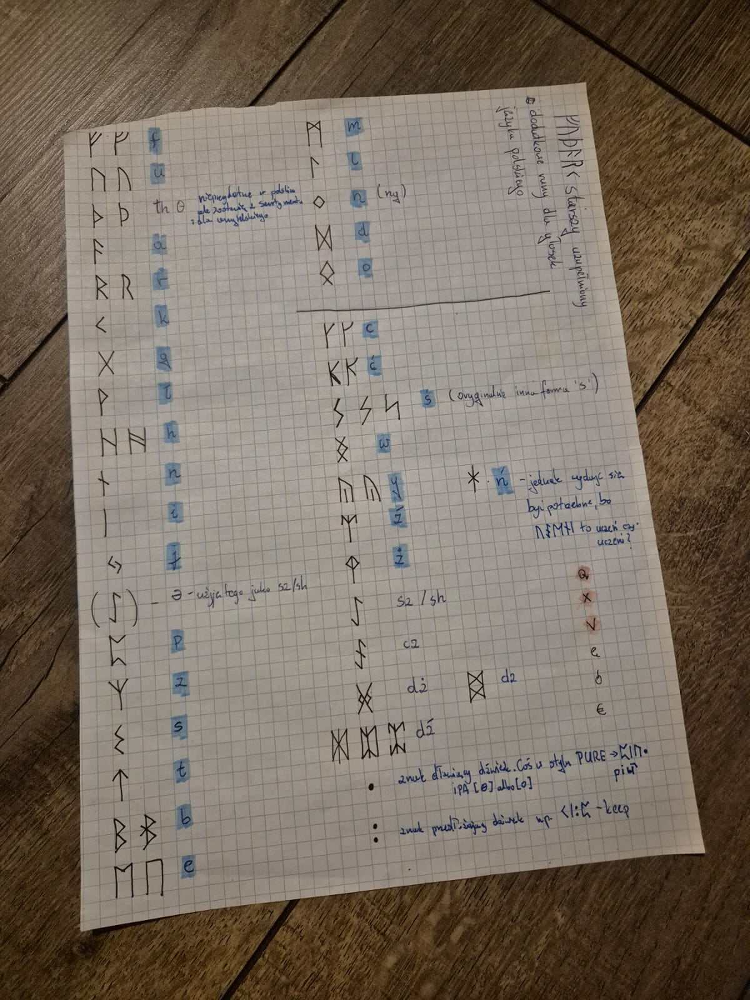

Polski (runiczny) keyboard
==============

Description
-----------
Attempt to convert polish phones from digraphes to monographes using runes from elder/younger ᚠᚢᚦᚨᚱᚲ and some saxon ones, because why not.
It is made for fun and it won't be usefull for anyone beside me, propably.

Installation
-----------
use .kmp packages for keyboard and lexical model from /export folder

- [pl-hints](./export/pl-hints) for latin-letter hints and arabic numbers
- [runr-hints](./export/runr-hints) for runic-glyph hints and dot-base numbers

Both does the same, they are just visual differences. Keyman does see them separately so you can have both installed in the same time.

Runes meaning
-----------
See [phones-table.md](phones-table.md) (polish)

The first idea
-----------
The idea was born in the bored mind of mine, sparked by frustration with the current writing system — which is rooted in archaic grammatical rules that now lack any apparent rationale and exist merely as arbitrary axioms.
 
### Homophones: 
*ż*/*rz*, *ch*/*h* (decades ago, *h* was a voiced sound, whereas now it is voiceless, like *ch*), *u*/*ó* (historically, *ó* represented a long *u* sound — essentially a double *o*).
 
### Digraphs 
pronounced differently than their constituent letters: *dz*, *dź*, *dż*, *sz*, *cz*, *si*, *ci*, *zi*. 

I also decided to replace vowels with 'tail?' using a separate *ng* marker: *ą* → *o*+*ng*, *ę* → *e*+*ng*.

-----------
The idea was "Read as you see". Some words got shorter, some longer. Switching to this script may be tricky. Ex. *ni* digraph is pronounced as long *ń* sound so I decided to write it like this: *ᚼᛁ* - *ńi*, which is not intuitive to write it this this way for native polish speaker. Same goes for *ś*, *ć*, *ź* and *dź* - *ᛋᛁ*, *Кᛁ*, *ᛠᛁ*, *ᛯᛁ*.

Of course, no one will actually use this writing system—just as English won't revert to its native Saxon runes. There is also literally no poin in writing this whole description in english as ᚨᛒᛖᚴᚨᛞᚹᛟ is not adapted to it. It can be used only to write it phonetically.

I utilized the Elder ᚠᚢᚦᚨᚱᚲ, a few Saxon runes, and custom variants shown on the ancient tablet below. 

[]

Later, when I decided to digitize the project, those extra glyphs proved problematic, so I had to replace them with similar Unicode characters. The result is acceptable (ᛉᚾᛟᛋᚾᚤ) to me.

Links
-----
Keyboard Homepage: https://keyman.com/keyboards/plrunic

License
---------
Do whatever you want with this. Beside crime.
See [LICENSE.md](LICENSE.md)

Supported Platforms
-------------------
 * Windows
 * Linux
 * iPhone
 * Android phone

~ᛝᚢᚲᛟ ᛞᚱᚨᚷᚷᚨᛁᛗᚨᚾ / ᚢᛚᚠ ᚾᛁᛏᛃ'ᛊᛖᚠᚾᛁ
